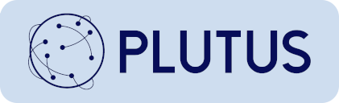

<p align="center">
  
</p>

<h1 align="center">
   Plutus
</h1>

<p align="center">
  A Gateway to Effortless Blockchain Fee Management
</p>

<p align="center">
  Plutus is a RESTful fee aggregator for scraping on-chain fee collection events.
</p>

<p align="center">
  <a href="https://github.com/kieranroneill/plutus/releases/latest">
    
  </a>
  <a href="https://github.com/kieranroneill/plutus/releases/latest">
    
  </a>
</p>

<p align="center">
  <a href="https://github.com/kieranroneill/plutus/blob/main/COPYING">
    
  </a>
</p>

#### Table of contents

* [1. Overview](#-1-overview)
  - [1.1. Project structure](#11-project-structure)
* [2. Development](#-2-development)
  - [2.1. Requirements](#21-requirements)
  - [2.2. Setting up environment variables (optional)](#22-setting-up-environment-variables-optional)
  - [2.3. Running locally](#23-running-locally)
* [3. Appendix](#-3-appendix)
  - [3.1. Useful commands](#31-useful-commands)
  - [3.2. Docker Compose service directory](#32-docker-compose-service-directory)
* [4. How To Contribute](#-4-how-to-contribute)
* [5. License](#-5-license)

## 🗂️ 1. Overview

### 1.1. Project structure

The project structure is, for the most part, self documenting, but below is an expansion on each directory:

* `images`: contains the [Docker][docker] images used by the both the API and the MongoDB database.
* `scripts`: contains various scripts used to setup, run and test.

<sup>[Back to top ^][table-of-contents]</sup>

## 🛠️ 2. Development

### 2.1. Requirements

* [Docker][docker]
* [Docker Compose v2.5.0+][docker-compose]
* [Node v20.9.0+][node]
* [Yarn v1.22.5+][yarn]

<sup>[Back to top ^][table-of-contents]</sup>

### 2.2. Setting up environment variables (optional)

1. Create a `.env` file into the `.config/` directory:
```shell script
yarn setup
```

2. Go to the `.config/` directory and edit the values in the `.env` file.

<sup>[Back to top ^][table-of-contents]</sup>

### 2.3. Running locally

1. Simply run:
```shell script
yarn start
```

> ⚠️ **NOTE:** The `yarn start` command will run/re-run the setup script, but will not overwrite the file `.env` that was created and edited in section [1.2.](#22-setting-up-environment-variables-optional)

2. Navigate to [http://localhost:3000/versions](http://localhost:3000/versions) to make sure everything is runnning.

<sup>[Back to top ^][table-of-contents]</sup>

## 📑 3. Appendix

### 3.1. Useful commands

| Command           | Description                                                                                                                              |
|-------------------|------------------------------------------------------------------------------------------------------------------------------------------|
| `yarn setup`      | Creates an `.env` file to the `.config/` directory.                                                                                      |
| `yarn start`      | Runs setup and starts Docker Compose. Intended for development purposes only.                                                            |

<sup>[Back to top ^][table-of-contents]</sup>

### 3.2. Docker Compose service directory

Here is a list of all the localhost port mappings for each of the apps

| Port    | URL                                                | Docker Compose Service | Description                                                          |
|---------|----------------------------------------------------|------------------------|----------------------------------------------------------------------|
| `3000`  | [http://localhost:3000](http://localhost:3000)     | `api`                  | The core application that scrapes the blockchain for emitted events. |
| `27017` | [http://localhost:27017](http://localhost:27017)   | `database`             | The MongoDB database that stores the collected fees.                 |

<sup>[Back to top ^][table-of-contents]</sup>

## 👏 4. How To Contribute

Please read the [**Contributing Guide**][contribute] to learn about the development process.

<sup>[Back to top ^][table-of-contents]</sup>

## 📄 5. License

Please refer to the [COPYING][copying] file.

<sup>[Back to top ^][table-of-contents]</sup>

<!-- Links -->
[contribute]: ./CONTRIBUTING.md
[copying]: ./COPYING
[docker]: https://docs.docker.com/get-docker/
[docker-compose]: https://docs.docker.com/compose/install/
[make]: https://www.gnu.org/software/make/
[nextjs-project-structure]: https://nextjs.org/docs/getting-started/project-structure
[node]: https://nodejs.org/en/
[table-of-contents]: #table-of-contents
[yarn]: https://yarnpkg.com/
